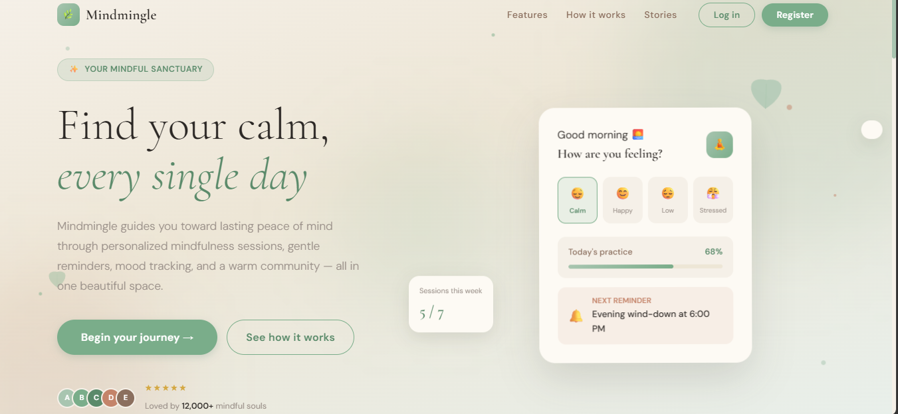
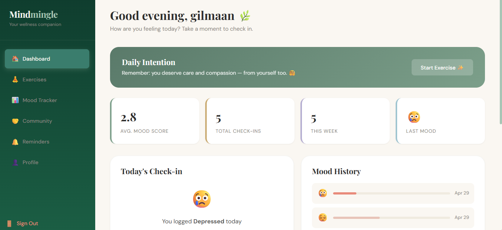
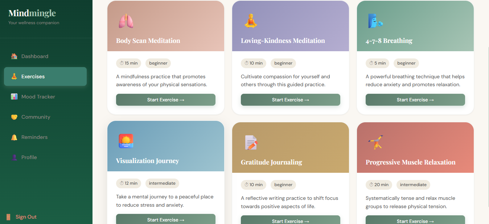
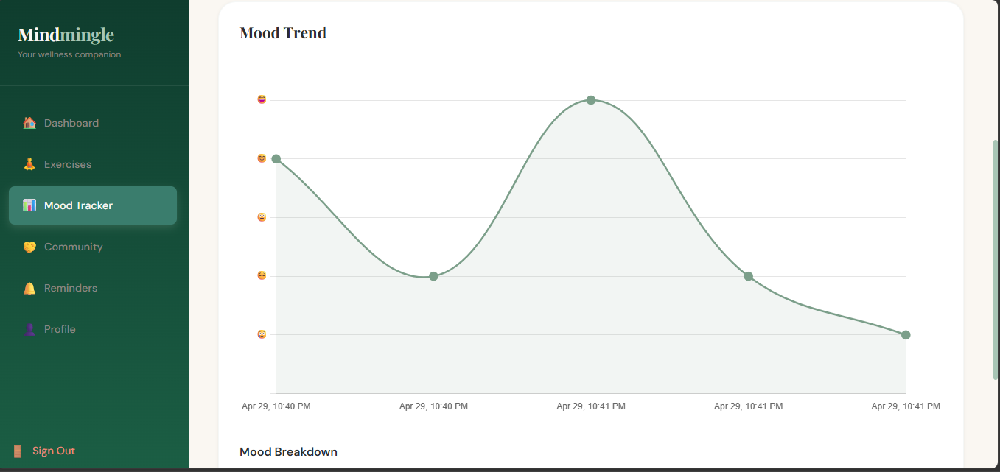
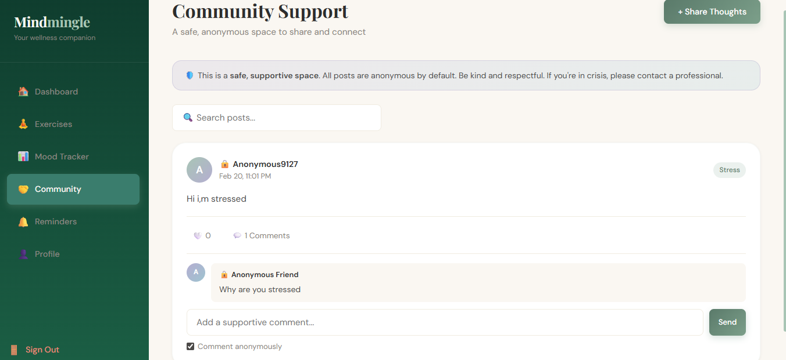
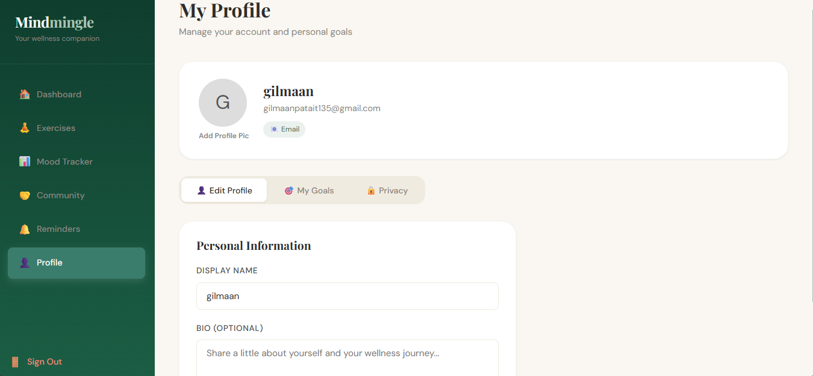

# 🧠 MindMingle – Mental Wellness & Mood Tracking Platform

A full-stack mental wellness platform that helps users track moods, perform mindfulness exercises, and engage in a supportive community.

---

## 🚀 Features

- 🧠 Mood Tracking with insights
- 🧘 Mindfulness Exercises (breathing, meditation, etc.)
- 🔔 Smart Reminders
- 👥 Anonymous Community Support
- 🔐 Secure Authentication (JWT + OAuth)
- 📊 Dashboard with analytics

---

### 🤖 AI Assistant (NEW)
- 💬 Chat-based mental wellness assistant
- 🧠 Provides emotional support & suggestions
- ⚡ Real-time responses using OpenRouter API
- 🎤 Voice input support (Speech Recognition)
- 🔊 Voice output (Text-to-Speech)

---

## 📸 Screenshots
### Home Page


### AI-Assistant


### Dashboard


### Exercises


### Mood Tracker


### Community Support


### Profile


## 🛠 Tech Stack

### Frontend
- React.js
- CSS

### Backend
- Node.js
- Express.js

### Database
- MongoDB

---

## 📁 Project Structure

```
mindmingle/
 ├── backend/
 ├── frontend/
```

---

## ⚡ How to Run

### 1. Clone the repo
```
git clone https://github.com/Gilmaan09/MindMingle.git
cd MindMingle
```

### 2. Backend
```
cd backend
npm install
npm start
```

### 3. Frontend
```
cd frontend
npm install
npm start
```

---

## 🌟 Highlights

- Full MERN Stack Application
- Clean UI with responsive design
- Real-world use case (mental wellness)
- REST API integration

---

## 🚀 Future Improvements

- Add AI-based mood suggestions
- Improve UI animations

## 👨‍💻 Author

**Gilmaan Patait**